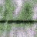
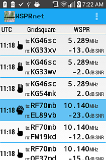
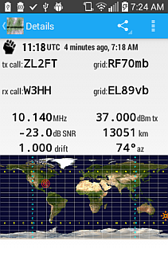
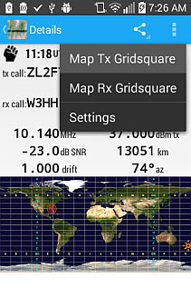
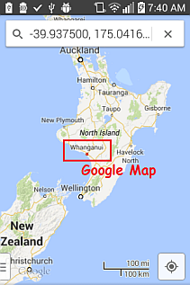
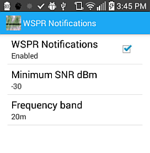
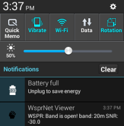
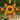
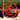

#  WsprNet Viewer

## Synopsis
WsprNet Viewer is an Android application that periodically retrieves and displays amateur radio ("ham radio") signal propagation reports from http://www.wsprnet.org.  Tapping on a specific report displays more information about it on a details screen, along with  a world map image identifying the  transmitter and receiver locations.  From the detail screen's menu,  you can share the report, or map the transmitter or receiver location using the Android device's map application.  The device can notify you when propagation is reported to be good  for a particular radio frequency band.
  
  
  
  
  

  
  

### Background
How well a radio signal travels ("propagates") is affected by its frequency (e.g., shortwave, VHF, UHF, microwave), distance, path, terrain, and atmospheric conditions between transmitter and receiver.  Radio waves tend to travel in straight lines.  For distances beyond the horizon (over ~20 miles), we might rely on them repeatedly bouncing between the ionosphere or other atmospheric phenomena, "hopping" along to a receiver.  Some aspects of this category of propagation are cyclical (as the sun rises and sets, or per 11-year sunspot cycles), but many are not so predictable and can vary in as little as a few minutes.

It's useful to have an idea of current propagation conditions at various radio frequencies for points around the globe.  A network of amateur radio beacons and receivers exists that continuously track radio propagation; this information is reported to a central website at http://wsprnet.org. 

#### About the Icons
WSPR receivers include the signal strength in their reports; this is equivalent to the "number of bars" displayed on a phone to indicate cell tower or WiFi signal strength.  To avoid confusion with these icons, WsprNet Viewer uses a hand holding up one to four fingers to indicate a good to poor signal; a clenched fist indicates a very poor signal:
  - 4 fingers:  over 0dBm 
  - 3 fingers:   -5 to 0dBm 
  - 2 fingers:  -10 to -5dBm 
  - 1 fingers:  -15 to -10dBm 
  - fist: less than -15dBm 

On the Details screen, the transmitter and receiver locations are identified by these icons:
  - Transmitter: 
  - Receiver: 

#### About the "Maidenhead Locator System"
Transmitter and receiver locations are reported and stored in the [Maidenhead Locator System](http://en.wikipedia.org/wiki/Maidenhead_Locator_System), a shorthand method of writing GPS coordinates using a combination of four or six numbers and letters.  Keeping the number of characters to transmit to a minimum is important when using low-speed communications such as Morse code, voice, or the WSPR protocol (which takes 110.6 seconds to transmit 50 bits or 1.5 bauds.)  Six characters identifies a longitude/latitude "grid square" of about 3 x 4 miles, which is sufficient resolution for propagation reports.  WsprNet Viewer displays the Maidenhead notation, but decodes it into longitude and latitude when marking locations on a map.

## Installation
  Installation is done using Android Studio, which automatically builds both a Debug and Release version.
  - Configure your Android device to allow USB Debugging:
      - Menu...System Settings...(System heading) Developer Options...(Debugging heading) USB Debugging 
  - Connect your Android device to a PC with a USB cable.
  - Install the Debug version using Android Studio's `Run` button.
  - Use the batch files:
       - `app/removeFromDevice.bat` to uninstall either Debug or Release version;
       - `app/installReleaseToDevice.bat` to install the Release version.

### Dependencies ###
This project uses the [jsoup](http://jsoup.org) HTML parsing library, which been added as a dependency to `app/build.gradle`. Android Studio will automatically retrieve it from Maven.

### Testing and Development
Development is done on Windows 7 with Android Studio 0.8.6 and 0.8.9.
Testing is done on an LG l34c phone with Android 4.4, and a Motorola Droid X phone with Android 2.3.4. 

### More Information
http://en.wikipedia.org/wiki/WSPR_%28amateur_radio_software%29

http://en.wikipedia.org/wiki/Radio_propagation_beacon

http://en.wikipedia.org/wiki/Radio_propagation

http://physics.princeton.edu/pulsar/K1JT/wspr.html

http://www.g4jnt.com/Coding/WSPR_Coding_Process.pdf

## Acknowledgements
WsprNet Viewer was developed to fulfill the Udacity online course [Developing Android Apps](https://www.udacity.com/course/ud853) requirements.  Thanks, [GDG-A3](http://www.meetup.com/GDG-A3) for the heads-up about the course! 
  
The icons are from icons8.com, which permits non-commercial use.
  
The map image is from http://en.wikipedia.org/wiki/Maidenhead_Locator_System.
  
http://www.survivingwithandroid.com/2014/04/parsing-html-in-android-with-jsoup.html for jsoup.

  
## Copyright and License

Copyright 2014 Joseph D. Glandorf. All rights reserved.

Licensed under the Apache License, Version 2.0 (the "License");
you may not use this file except in compliance with the License.
You may obtain a copy of the License at

   http://www.apache.org/licenses/LICENSE-2.0

Unless required by applicable law or agreed to in writing, software
distributed under the License is distributed on an "AS IS" BASIS,
WITHOUT WARRANTIES OR CONDITIONS OF ANY KIND, either express or implied.
See the License for the specific language governing permissions and
limitations under the License.

